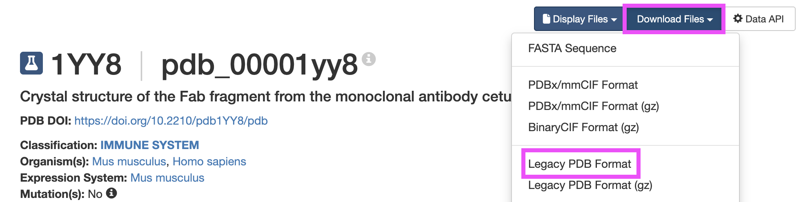
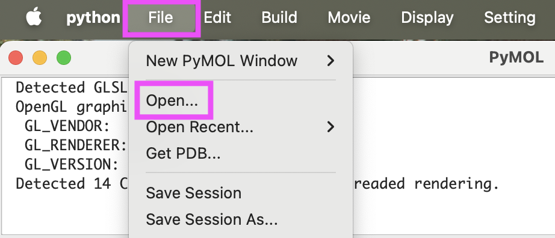
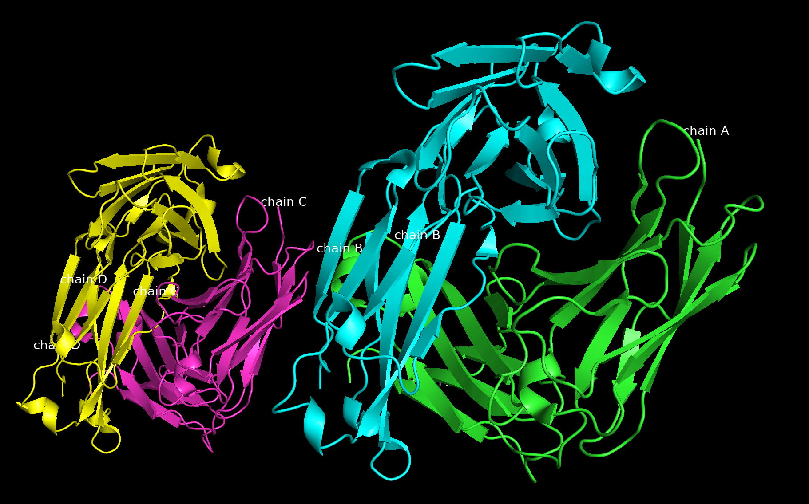
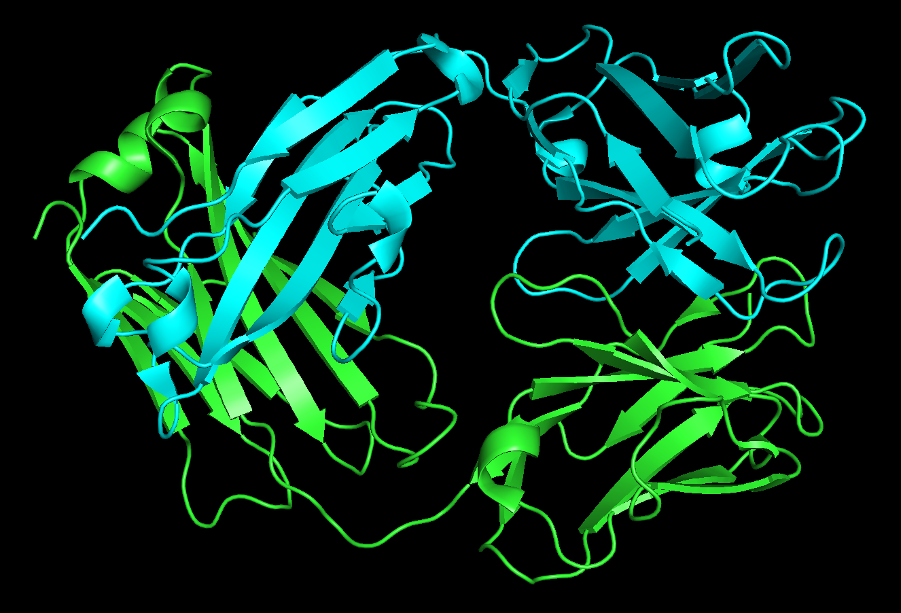
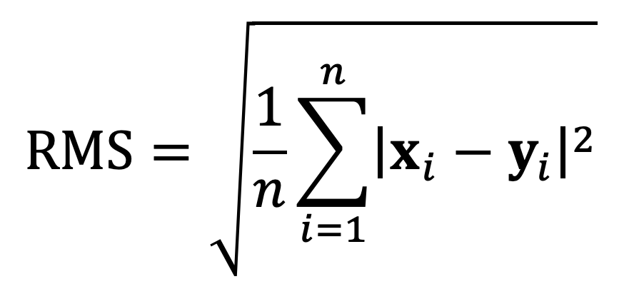

# Introduction to PyMOL

## Contents:
- [Introduction](#introduction)
    - [Other Molecular Visualization Tools](#other-molecular-visualization-tools)
    - [Suggested Readings and Resources](#suggested-readings-and-resources) 
- [Learning the Basics](#learning-the-basics)

## Introduction
[PyMOL](https://www.pymol.org/) is a molecular visualization tool with several features that make it particularly useful for the visualization of proteins. PyMOL is maintained and distributed by [Schrödinger](https://www.schrodinger.com/) and installing any precompiled binaries from their website requires a [license](https://www.pymol.org/buy). **However, the open-source 'foundation' of the tool is available on [GitHub](https://github.com/schrodinger/pymol-open-source?tab=readme-ov-file) and does not require a license.**

While many other pieces molecular visualization software exist (see [Other Molecular Visualization Tools](#other-molecular-visualization-tools)), we will focus on PyMOL because it has excellent features for viewing, renders complex structures quickly, and has excellent display quality. PyMOL also makes it easy to define custom objects, view multiple structures at once, and if you are using the open-source version, you can easily create new functions such as colors and measurements related to your specific needs. 

In this workshop you will become familiar with: 
1. The basic operation of the software
1. The tools for analyzing protein structures and for creating high-quality graphics
1. The ability to create and save scripts for repeated use

### Other Molecular Visualization Tools
Other molecular visualization tools, both commercially and publicly available include: 
- UCSF ChimeraX: [www.cgl.ucsf.edu/chimerax/](https://www.cgl.ucsf.edu/chimerax/)
- VMD: [www.ks.uiuc.edu/Research/vmd](http://www.ks.uiuc.edu/Research/vmd)
- MolSim@Berkeley
- Swiss-PDB Viewer: [spdbv.unil.ch/](https://spdbv.unil.ch/)
- BIOVIA Discovery Studio Visualizer: [discover.3ds.com/discovery-studio-visualizer-download](https://discover.3ds.com/discovery-studio-visualizer-download)
- and many more!

### Suggested Readings and Resources
-  Introductory: Chapters 1 and 2 of Brandon and Tooze, *Introduction to Protein Structure*, Garland Publishing (1999).
- Advanced: J. S. Richardson, “The Anatomy and Taxonomy of Protein Structure,” 1981 (updated 2000-2007), available at http://kinemage.biochem.duke.edu/teaching/anatax.
- [PyMOL Wiki](https://pymolwiki.org/Main_Page)
- Making Pretty Pictures in PyMOL [v1](https://www.blopig.com/blog/2021/01/making-pretty-pictures-with-pymol/) and [v2](https://www.blopig.com/blog/2024/12/making-pretty-pictures-in-pymol-v2/)

## Learning the Basics
To learn some of the basic functions of PyMOL, we will use an example PDB file for protein 1YY8, you can download it's PDB file from the [RCSB PDB library](https://www.rcsb.org/structure/1YY8). Once you have found the protein, go to **Download Files** and then select **Legacy PDB Format**. 



### Load a Structure File
Open PyMOL. (If asked, use the PyMOL + Tcl/Tk mode.) Load 1YY8.pdb: From the menu bar select File → Open → and then navigate to where you stored the PDB file and select it.



### Mouse Actions
You can use your mouse to rotate and translate the structure and zoom in and out of the display. Mouse actions will vary based on operating system: 
<details>
    <summary>Linux or PC</summary>
    <ul>
        <li>Left button: rotate</li>
        <li>Middle button: translate</li>
        <li>Right button: zoom</li>
    </ul>
</details>

<details>
    <summary>Mac</summary>
    <ul>
        <li>Left button: zoom</li>
        <li>Middle button: translate</li>
        <li>Right button: rotate</li>
    </ul>
</details>

<details>
    <summary>Touchpad</summary>
    <ul>
        <li>Two-finger click and drag: zoom</li>
        <li>One-finger click and drag: rotate</li>
        <li>Ctrl or Command + click and drag: translate</li>
    </ul>
</details>

If you are curious about what the mouse actions are with PyMOL on your particular system, you can see all possible options in the menu at the bottom right-hand corner of the window: 


## Viewing Options
In the right hand menu you should see an entries labeled 'all' and '1YY8' with buttons 'A', 'S', 'H', 'L', and 'C' next to them: 


These buttons control the view of the item its attached to, here are a quick summary of what each button does: 
- A (action): quick manipulation of the structure for anything from centering the structure in the display to highlighting polar contacts 
- S (show): allows you to change the molecular representation (ribbon, sticks, etc.)
- H (hide): allows you to hide anything you revealed in the display using the show menu
- L (label): shows labels of different portions of your structure
- C (color): color the structure using various presets

In the line for 1YY8, select Hide→Everything, then Show→Cartoon, then Color→By Chain→By Chain (elem C), then Label→Chains. Here is what your structure should look like once you are done: 



You should see two copies of the antibody fragment, since there were two copies of the antibody in the unit cell of the crystal that was measured to determine the structure. You should be able to see two separate chains in each antibody fragment, these should be labeled A, B, C, and D. 

## Using the Command Line
PyMol has its own built-in command line prompt, what it looks like will depend on your PyMOL version. Windows labels it as `Tcl/Tk GUI` or `The PyMOL Molecular Graphics System`. On Mac the prompt is above the display area and has the prompt `PyMOL>`. 

In the command-line window type hte following commands: 
```none
select AB, chain A+B
hide all
show cartoon, AB
orient AB 
```

This will:
1. Select all of the residues in chains A and B and create a new item in the right-hand menu labeled 'AB'.
1. Hide everything (even what you just selected).
1. Display your selection as a cartoon. 
1. Center chains A and B in the display area. 

When you are done you should have something that looks like this: 



Note that since 'AB' is now its own item, it has its own set of visualization buttons that will only act on chains A and B.

You can use the mouse or the [`select`](https://pymolwiki.org/Select) command with other protein descriptors (e.g., `name ca+cb+cg+cd`, `symbol o+n`, `resn lys`, `resi 100-150`, `ss h+s+l`, `hydro`, or `hetatm`)
to create objects for various subsets of the molecule, and there are a variety of operations you can perform on those subsets.
You can also combine descriptors (chain A and hydro) and assign it a selection name as inthe following:
```none
select linkerA, chain A and resi 107-112
color red, linkerA
select linkerB, chain B and resi 117-122
color orange, linkerB
```
Note that there is a distinction in PyMOL — as in many scripting/coding languages — between the addition operator `+` and the Boolean operator `and`. The addition operator acts as a union operator to combine selections (similar to a mathematical OR operator). `and` restricts the selection to only items that meet both required criteria. 

Type `help select` and `help selections` for full details. (Hit the Esc key to exit the help screen, if necessary.) Test out the mouse operations and various colorings and display options to get a feel for the general operation of the molecular visualization.

Note that you can use File→Save	Session at any time. This will store all your objects, selections, and views.

## Structural Analysis
The structure you have downloaded is cetuximab, a therapeutic antibody in development for cancer treatment. Antibodies are composed of two heavy chains and two light chains; the particular construct of its upper part is known as a Fab fragment and contains one full light chain (chain A) and the N-terminal half of one heavy chain (chain B). At one end of the Fab fragment are six loops known as the “complementarity determining regions” (CDR), which bind a particular antigen. For the following four problems, we will examine the N-terminal domain of chain A (the light chain). 

To make this easier, type `select L, chain A and resi 1-107`, then from the right panel controls, hide everything but for selection L and click Color→Spectrum→Rainbow. Your display should now show something like this: 


### Exercises
1. Looking down the direction of the first strand, which way does it twist? Do all strands twist in the same direction? 
2. Next, let’s analyze a couple strands in the N-terminal domain.
    <ol type="a">
        <li>Zoom in on strands 3 and 8, (which should be adjacent and colored cyan and marigold, respectively.) What are the residue number ranges for these two strands? (Click on the strand ends and look in the console window for the residue numbers.)</li>
        <li>Create a new object for these two strands with `select` and hide the rest of the molecule. Display the atoms of the amino acid and color them by their element. (Show→Sticks and Color→ByElement, any of the menu options are fine.) 
        <ol type="i">
            <li>What color are oxygen atoms?</li> 
            <li>What color are nitrogen atoms?</li> 
        </ol></li>
        <li>By looking at the side chains, identify the amino-acid sequence (using 1-letter abbreviations) of strands 3 and 8. What pattern do you you observe and why does it occur?</li>
    </ol>
3. Let's analyze some geometry. From the main menu, select Wizard→Measurement. You should see a panel on the right in which you can select distances, angles, dihedrals, and neighbors, and PyMOL will prompt you to select the atoms for measurement. Using Label→Residues (oneletter) on your selection from the right-side panel might also be helpful.
    <ol type="a">
        <li>What is the distance between the N of L73 and the O of F21 (i.e., the hydrogen bonding distance across the β chain)?</li>
        <li>Measure all of the backbone hydrogen bonding distances between these two strands. What is the range of distances you observe?</li>
        <li>On residue F21, what is the bond angle around C<sub>β</sub>? (In the measurement menu in the bottom right of your screen you can click on 'Distances' to change the measurement type.)</li>
        <li>On residue F21, measure φ, ψ, and χ<sub>1</sub>. Confirm that these values are within the β-sheet region of the Ramachandran plot.</li>
        <li>Type <code>h_add chain A and resi 73</code> to place hydrogen atoms on residue 73. (Hydrogens are usually too small to see by crystallography, so PyMOL must calculate the theoretical positions.) What is the H–O–C bond angle for the backbone hydrogen bond between residues L73 and F21? </li>
    </ol>
4. Restore the view of L and sketch (on paper) a “Brandon & Tooze style” topology diagram (not a 3- D sketch!) showing the β-sheet strand arrangement for the light chain. Hint: Begin by drawing strand 1 on the bottom left side of the paper pointing up. There are two separate sheets; draw one atop the other; otherwise, it implies a single sheet. Draw the secondary structure first, and then connect the linkers. Do not try to approximate the size of linkers between secondary structure. (p. 62 of Brandon & Tooze has an example of such a two-row topology diagram.)

**Comparing Molecules**

5. From <a href="https://www.rcsb.org">www.rcsb.org</a> find a second PDB file of cetuximab, this time bound to its antigen. 
    <ol type="a">
        <li>What is the antigen?</li>
        <li>Clear your current PyMOL session (All→Actions→Delete	everything) and load your new PDB file. Use the cartoon view and color and label by chain to see an overview of the structures. You should see the antibody Fab fragment and the antigen. The antigen also has several post-translational glycosylation modifications.</li>
        <li>Load 1YY8 into the same session. As you did before, create an object for chains A and B and hide chains C and D. (You will now need to specify the molecule: <code>select unboundFab, 1YY8 and chain A+B</code>.) Similarly, create an object (call it <code>boundFab</code>) for the Fab fragment of the bound complex. (Be careful to specify the correct chain identifiers; they are arbitrary and can vary between PDB files.) Now, superimpose the two structures using align <code>unboundFab</code>, <code>boundFab</code>.</li>
        <li>The structural match between the two molecules is measured by the root-mean-squared (RMS) distance of the aligned atoms:</br>
        </br>
        where <strong>x<sub>i</sub></strong> and <strong>y<sub>i</sub></strong> are the vector coordinates (displacement vectors) of the <strong>n</strong> atoms in the two structures. The align command automatically generates a sequence alignment to pick the right atoms to compare and then solves for and executes the coordinate transformation that yields the minimal RMS deviation between the structures.</li>
    </ol>
6. In the command window, there should be a few lines describing the alignment process. What is the RMS error calculated for this structural alignment (include units)? Over how many atoms?
7. Is there much difference between the bound and unbound forms of the antibody? In particular, are there differences in the six complementarity-determining loops at the far end of the N-terminal domains?
    

## High-Quality Visualization and Scripting
Your commands can be saved to a file or read in from a file. Use the File→Log File options to record your steps and create a script. You can edit this script using a text editor, such as Emacs or vi/vim. You can then read in the script using File→Run or simply with the command `run myfile.pml`. (UNIX commands, such as `pwd`, `ls`, and `cd`, can be typed in PyMOL to assist in locating any scripts you wish to run.) The script will record all of your settings, but not necessarily the transformations you make by reorienting the molecule with the mouse. To record the screen orientation matrices in your script, type `get_view`. The command ray will use a ray-tracing algorithm to compute the lighting on the molecule. (ray 800,800 will set the image size to 800 × 800 pixels.) Use this before saving an image using File→Save Image to create publication-quality results. Since the natural background color on a piece of paper is white, use the command `bg white` to change the background color (and use less ink!). Other options are under the Display menu; some options that may help include Display→Color	 Space→CMYK and Display→Depth Cue→On. The menu command Setting→Transparency can also help show depth and occluded molecules, but it is most important to orient the molecule carefully to show features and to hide all but the most relevant parts of the molecule. Finally, you might also try some of the preset settings from the right-side menu under Actions→Preset.

8. For your last task, choose an interesting feature of cetuximab (β-sheet structure, the antibody complementarity-determining regions, a comparison of bound and unbound antibody loops or the CDR H3 loop in detail, the glycosylation on one of the EGFR side chains, etc.) and create a beautiful, ray-traced, white-background, publication quality figure. Color and label protein features and measurements as you feel appropriate. Use the script feature to gather the list of commands that you find optimal for viewing your object. Edit the script to eliminate the non-essential pieces and make the script clean, concise, and comprehensible.

    If you are doing this exercise for a class, submit the figure printed in color, the script that can re-create the figure, and a brief statement of which structural feature your figure is designed to show.

    If you work in a research lab, you are encouraged to create a new figure for a protein relevant to your research.